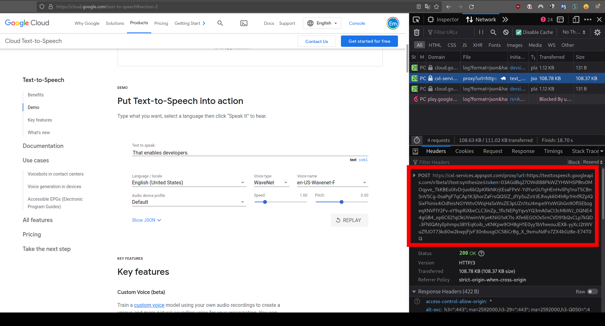

# Commandline tool to convert text to audio files using Google Cloud Text-to-Speech

This commandline helper converts given text or file (line by line) to audio file(s) using Google Cloud Text-to-Speech API.

As it uses Google's demo page (https://cloud.google.com/text-to-speech#section-2) as resource, you first need to
visit that page and copy the demo token from the network tab.

Click on "SPEAK IT" button once and grab your token using developer tools:



URL with the token should start like: https://cxl-services.appspot.com/proxy?url=https://texttospeech.googleapis...

Once copying, you can pass it as `--token=YOUR_TOKEN` argument or save it in an `.env` file. Please see
[.env.example](./.env.example) file: You can rename it to `.env`.

⚠️ To not hammer demo endpoints, each sentence in a given file is being processed every 1000 milliseconds.
Even if you shorten timeout, you'll probably end up with invalidating your demo token. So try to put one sentence
per line. Please see the [example-sentences.txt](./example-sentences.txt) file as reference.

## Prerequisites

* `git`
* `node`
* `npm`

## Installing

Clone the repo and install dependencies:

```bash
git clone git@github.com:pemre/text-to-speech.git
cd text-to-speech
npm i
```

For basic help and usage examples:

```bash
node index.js --help
> ...
> Arguments:
>   --convert : (Required) Has two options: file | text
>   --input   : (Required) Expects either a filename or a string depending on the convert argument.
    --output  : (Optional) Output filename without extension. Default: audio
    --token   : (Required) The demo token from Google demo page https://cloud.google.com/text-to-speech#section-2
                           You can use an .env file to not pass it as an argument.
                           Please see .env.example file.
> ...
```

## Usage: Converting text to wav file

Examples below assumes that you have the `.env` file that includes your token:

```bash
node index.js --convert text --input "The Turkish Angora is a breed of domestic cat."
> Converted text into audio file: audio.wav
```

If you provide `--output` argument, you can change the default output filename (without extension):

```bash
node index.js --convert text --input "This is a sentence." --output sentence1
> Converted text into audio file: sentence1.wav
```

If you don't want to use an `.env` file, here is an example with `--token` argument:

```bash
node index.js --convert text --input "This is a sentence." --output sentence1 --token "YOUR_TOKEN" 
> Converted text into audio file: sentence1.wav
```

## Usage: Converting sentences in a file to multiple wav files for each line

For each line, a new audio file will be created.

The filename template is: `{output} {line count} ${first 20 chars of the line}.wav`.

⚠️ As the process is async, the output and the logs may or may not be in order:

```bash
node index.js --convert file --input example-sentences.txt
> Converted text into audio file: audio 3 The breed has been d.wav
> Converted text into audio file: audio 2 Turkish Angoras are .wav
> Converted text into audio file: audio 4 The breed is also so.wav
> Converted text into audio file: audio 1 The Turkish Angora (.wav
```

Again, you can provide `--output` (optional) and `--token` arguments (or via `.env` file).

## Improvements

* Some configs like `VOICE_NAME` (default is `en-US-Wavenet-H`) from [config.js](./config.js) file can be given as
arguments.
* The tool might be published on npm.

## Resources

* https://cloud.google.com/text-to-speech#section-2
* Method: text.synthesize https://cloud.google.com/text-to-speech/docs/reference/rest/v1/text/synthesize
